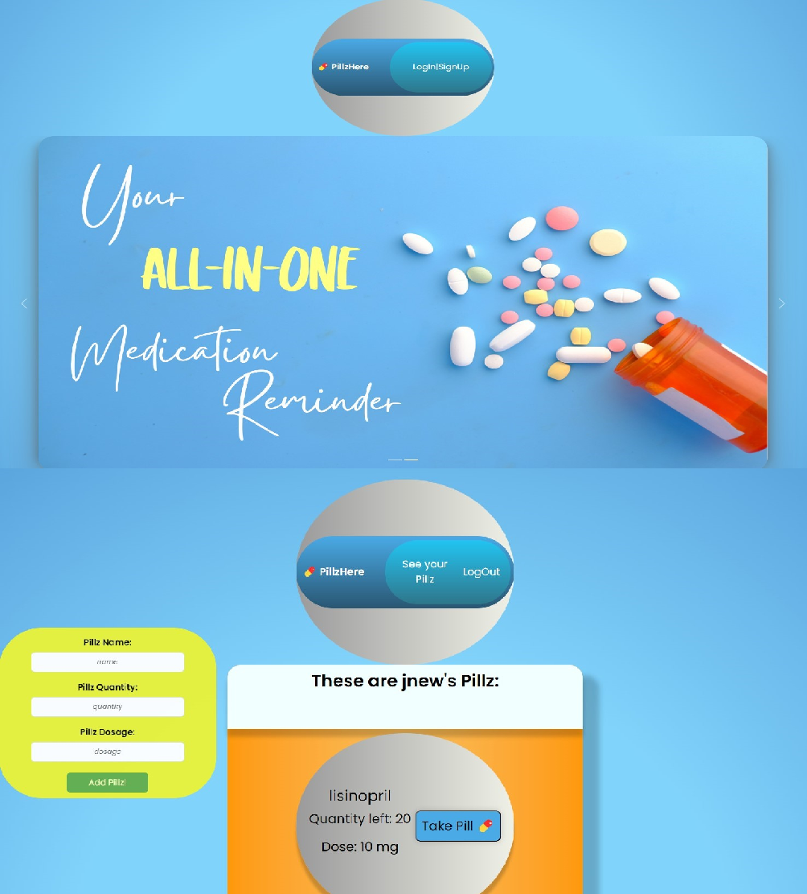

# PillzHere


## Table of Contents

- [Description](#description)
- [Installation](#installation)
- [Usage](#usage)
- [Credits](#credits)
- [Links](#links)

## Description

Welcome to our PillzHere application! In the middle of all of our hectic schedules, taking medications can be easily forgotten. We all need a little reminder here and there! This application was made for those who take daily medications, and need a little reminder when to take it, how many to take, and the dosage of said medication. This app was created using the MERN stack, as well as Vite PWA so that the application can be downloaded! The acceptance criterias are listed below:

```md
GIVEN a medication reminder app
WHEN I load the application
THEN I am presented with the login page with the option to log in or sign up
WHEN I click on the LogIn/SignUp button
THEN I am presented with a modal that allows me to toggle between the option to log in or sign up
WHEN I sign up for an account
THEN I am logged into my new account
WHEN I click on See your Pillz 
THEN I am presented with my saved Pillz and have the option to add more Pillz
WHEN I fill in the information to add a new pill and click Add new Pill
THEN the new pill populates at the bottom of the list of Pillz
WHEN I click log out
THEN I am taken back to the main login page
WHEN I log back into my account
THEN all of my information still populates
```

## Installation

In order to navigate through the PillzHere code, you will need to:

- Install the dependencies in the package.json files by running `npm i` in the integrated terminal <br>
- Run the files by typing `npm run develop` in the root directory of the integrated terminal <br>


## Usage

As a user, you can navigate through PillzHere by first creating an account. In the navigation bar, you can click the ```LogIn|SignUp``` button. Once you click it, a modal will open and you will be able to either log in or sign up for an account. You will first need to navigate to the sign up modal and create a new account. Once you put in all of the fields (username, email, and password), you will be able to click the ```Sign Up!``` button. Once you sign up, it will automatically log you in to your new account!

If you already have an account, from the navigation bar, you can click the ```LogIn|SignUp``` button and navigate to the ```Login``` modal. There, you will need to enter your email and password in order to log in. Once you type in the correct information and click the ```Log In!``` button, you will be logged in to your account!

Once you are logged in, you have the option to ```See your Pillz``` or ```LogOut``` in the navigation bar. When you click the ```See your Pillz``` button, you will be sent to another endpoint. From here, you will be able to see a list of all of your medications, if you have any saved! You also have the option to add your medications! There is a pill form to the left of the page that allows you to enter your ```Pillz Name```, ```Pillz Quantity```, and ```Pillz Dosage```. Once you type all of those in and click the ```Add Pillz!``` button, your new Pillz will appear at the bottom of your list! 

Once you are all done with your account, you can click the ```LogOut``` button in the navigation bar at the top of the page and you will be routed back to the main log in page!

You can also download PillzHere by clicking the download button in the address bar! The desktop version works the same as the web version, and they also communicate flawlessly for your convenience, so that even when you are offline, you have access to PillzHere!

You can see how PillzHere appears below:




## Credits

Thank you, Andrew B and Chris B, for all your help! 😊👍


## Links

[GitHub Repository](https://github.com/jkimys2/PillzHere) <br>
[Deployed Page](https://pillzhere.onrender.com/)
